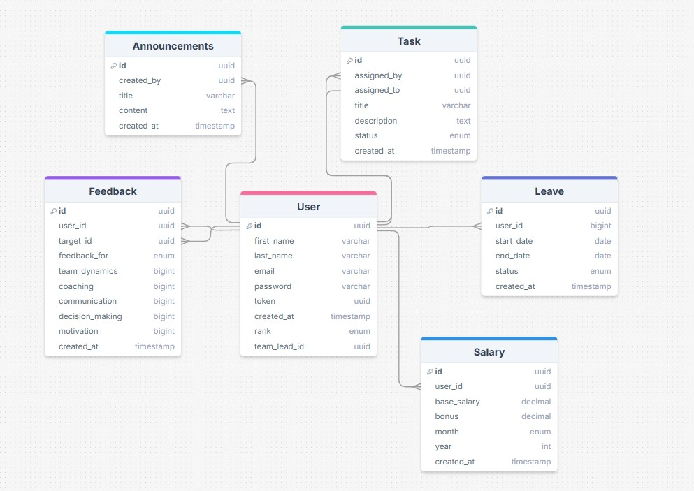

# Aplicatie pentru Gestiunea Resurselor Umane

## Descrierea Proiectului

### Obiectiv  
Aplicația este o platformă completă de HR Management pentru companii, destinată angajaților, managerilor și adminilor. Oferă funcționalități de gestionare a utilizatorilor, concediilor, salariilor, feedback-ului, anunțurilor și task-urilor, cu un sistem de acces diferențiat pe roluri.

---

## Funcționalități Principale

### Angajați
- Autentificare și gestionare profil
- Oferirea de feedback anonim managerului
- Vizualizare anunțuri
- Trimitere cereri de concediu și verificare status
- Vizualizare salarii și descărcare fluturaș PDF
- Vizualizare și actualizare status task-uri

### Manageri
- Vizualizare echipă proprie
- Vizualizare și analiză feedback primit
- Generare raport NPS și sumar AI (OpenAI)
- Aprobare/respingere concedii pentru echipa proprie
- Asignare, monitorizare și ștergere taskuri
- Vizualizare performanță angajat și performanță medie a echipei

### Admini
- Adăugare și modificare utilizatori
- Setare și actualizare salarii + bonusuri
- Postare anunțuri generale
- Monitorizare performanță generală a angajaților
- Acces complet la toate funcțiile aplicației

---

## Rute API testate (Postman)

### Autentificare (`/api/auth`)
- `POST /register`
- `POST /login`
- `POST /logout`

### Utilizatori (`/api/users`)
- `GET /profile/:id`
- `PUT /update/:id`
- `PUT /update-password`
- `GET /all`

### Anunțuri (`/api/announcements`)
- `GET /`
- `POST /create`
- `DELETE /delete/:id`

### Feedback (`/api/feedback`)
- `POST /add`
- `GET /:managerId`
- `GET /nps`
- `POST /summary`

### Concedii (`/api/leave`)
- `POST /request`
- `GET /`
- `PUT /set-status`

### Salarii (`/api/salary`)
- `POST /set`
- `PUT /update/:id`
- `GET /payslip/download`

### Taskuri (`/api/tasks`)
- `GET /`
- `PUT /update-status`
- `POST /assign`
- `DELETE /delete/:taskId`

### Echipe (`/api/team`)
- `GET /members`
- `GET /performance/:employeeId`
- `GET /performance/total`

---

## Modele de date (Sequelize)

- `User`
- `Feedback`
- `Leave`
- `Salary`
- `Task`
- `Announcement`

---

## Autentificare și Autorizare

- JWT salvat în `httpOnly cookie`
- Middleware:
  - `authenticateUser` – verifică tokenul și atașează `req.user`
  - `authRankMiddleware(...roles)` – permite accesul pe bază de rol

---

## Logica Backend

Aplicația este organizată după principiul MVC și include următoarele componente:

### 1. Modele Sequelize
- Reprezintă structura tabelelor din DB și relațiile dintre entități
- Exemple:
  - `team_lead_id` leagă angajații de manageri
  - `Feedback` conține `user_id` (cel care oferă) și `target_id` (cel care primește)

### 2. Middleware-uri
- `authenticateUser`: autentifică cererile folosind JWT
- `authRankMiddleware`: permite doar accesul utilizatorilor cu roluri specifice

### 3. Controlere
- Conțin logica de business: validări, interogări DB, procesare date
- Exemple:
  - `FeedbackController` face calcul NPS + apel AI pentru sumar
  - `LeaveController` verifică dacă managerul e responsabil de cerere

### 4. Rute Express
- Fiecare modul are propriul fișier de rute
- Middleware-urile sunt aplicate pe fiecare rută în funcție de acces

### 5. Generare PDF și Rapoarte AI
- `PDFKit` pentru fluturașul de salariu
- `OpenAI API` (GPT-3.5) pentru sumarizarea feedbackului textual

### 6. Performanță și Analitică
- Calcule pe baza taskurilor completate și feedback oferit
- Performanță individuală și a echipei managerului

---

## Vizualizare Schema Bază de Date

---

## Tehnologii Utilizate

### Backend
- Node.js + Express
- Sequelize ORM (PostgreSQL)
- JWT pentru autentificare
- PDFKit pentru generare PDF
- OpenAI API pentru sumarizare feedback

### Frontend *(în dezvoltare)*
- React.js

### Alte Unelte
- Visual Studio Code
- Postman (pentru testare)
- pgAdmin / DBeaver pentru DB management
