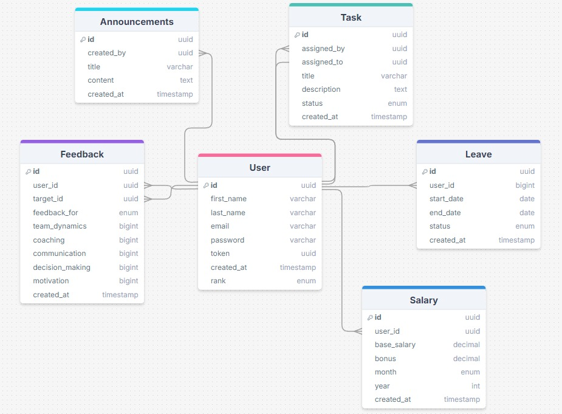

# Aplicatie pentru gestiunea resurselor umane intr-o companie

##  Descrierea Proiectului

###  Obiectiv
Această aplicație web este un sistem de management al resurselor umane destinat companiilor. Aplicația permite gestionarea eficientă a angajaților, feedback-ului, concediilor, salarizării și performanței acestora. Oferă atât angajaților, cât și managerilor un mediu centralizat pentru administrarea și optimizarea proceselor interne de HR.

---

##  Funcționalități

###  Funcționalități pentru Angajați
- *Autentificare și profil personalizat*
- *Vizualizare lista angajaților și organigramă*
- *Oferirea de feedback managerilor*
- *Solicitare concedii și verificare zile rămase*
- *Vizualizare salariu și descărcare fluturaș de salariu în PDF*
- *Pontaj (Check-in / Check-out) și vizualizare ore lucrate*
- *Acces la anunțuri și notificări interne*
- *Vizualizare și gestionare task-uri asignate de manageri*
- *Marcarea task-urilor ca finalizate și actualizare progres*

###  Funcționalități pentru Manageri
- *Vizualizare și administrare echipă*
- *Primire și analiză feedback de la angajați*
- *Rapoarte detaliate și sugestii de îmbunătățire pe baza feedback-ului*
- *Vizualizare NPS Score și grafice pentru evaluare*
- *Aprobarea sau respingerea cererilor de concediu*
- *Monitorizare ore lucrate ale echipei și raport lunar*
- *Postare anunțuri și notificări pentru echipă*
- *Acces la Dashboard Analitic HR cu statistici despre echipă*
- *Adăugare și gestionare task-uri pentru echipa proprie*
- *Monitorizare progresul task-urilor și actualizare status*

###  Funcționalități pentru Admini
- *Gestionare utilizatori (Angajați, Manageri, Admini)*
- *Introducere și actualizare salarii + bonusuri*
- *Generare automată a fișelor de plată în PDF*
- *Publicare anunțuri globale pentru întreaga companie*
- *Monitorizare performanță generală a angajaților*
- *Acces la toate rapoartele analitice HR*

---

## 🔹 Caracteristici principale

###  Backend
#### ** Modele utilizate:**
- User
- Feedback
- Leave
- Salary
- Task
- Announcement

---

##  Controllers utilizate în Backend (Node.js, Express)

###  Controllere accesibile tuturor utilizatorilor
- *AuthController*: register, login, logout
- *UserController*: getUserProfile, updateUserProfile
- *FeedbackController*: addFeedback
- *LeaveController*: requestLeave, getLeaveStatus
- *SalaryController*: getSalaryDetails, downloadPayslip
- *AttendanceController*: checkIn, checkOut, getAttendance
- *AnnouncementController*: getAnnouncements
- *TaskController*: getAssignedTasks, updateTaskStatus

###  Controllere specifice Managerilor
- *TeamController*: getTeamMembers, getEmployeePerformance
- *FeedbackController*: getFeedbackByManager, generateNPSReport
- *LeaveController*: approveLeave, rejectLeave
- *AttendanceController*: getTeamAttendance
- *AnnouncementController*: postAnnouncement
- *TaskController*: assignTask, updateTaskStatus, deleteTask
- *AnalyticsController*: getTeamStats, getEmployeeTrends

###  Controllere specifice Adminilor
- *UserController*: addUser, getAllUsers, updateUser, deleteUser
- *SalaryController*: setSalary, updateSalary, generatePayroll
- *AnnouncementController*: postGlobalAnnouncement, deleteAnnouncement
- *AnalyticsController* (opțional): getHRMetrics, getCompanyPerformanceReports

---

##  Logica Backend
*TBA* - Va fi definită ulterior.

---

## Schema Bazei de Date (MySQL)

## ⚙ Tehnologii Utilizate

###  Backend
-  *Node.js* cu *Express.js*
-  *JSON Web Tokens (JWT)* pentru autentificare și securitate

### 🎨 Frontend
-  *React.js*

###  Alte Unelte
-  *Visual Studio Code* - IDE principal pentru dezvoltare
-  *Postman* - Testare API-uri